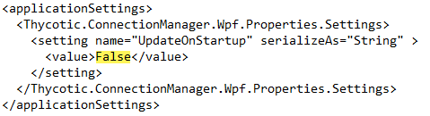

[title]: # (Configuration File)
[tags]: # (user)
[priority]: # (500)

# Configuration File

The Connection Manager configuration files can be found at the default locations indicated below.

## Windows Configuration File Location

C:\Program Files\Thycotic Software Ltd\Thycotic Connection Manager\Thycotic.ConnectionManager.exe.config for Windows

## macOS Configuration File Location

/Users/`<yourusername>`/Library/Preferences/com.Thycotic.ConnectionManager.plist

### Disable update check on startup for Windows

To disable automatic checking for updates on startup, for Windows open the configuration file and change the value to False as depicted in the screen shot.

### Disable update check on startup for macOS

To disable automatic checking for updates on startup for macOS, in Terminal type:

`defaults write com.Thycotic.ConnectionManager Env.CheckUpdateOnStartup -bool false`
