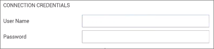
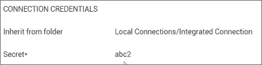
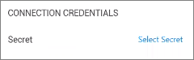
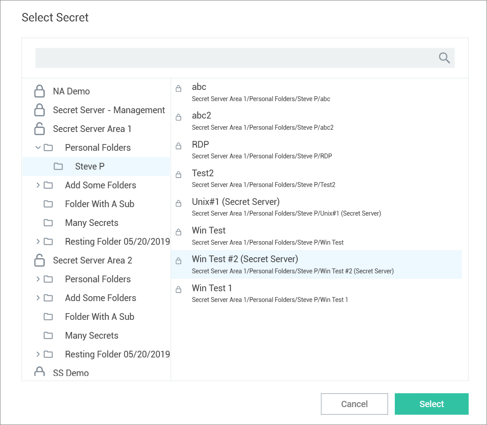
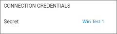

[title]: # (Integrated Connection)
[tags]: # (connection, integrated)
[priority]: # (506)

# Create an Integrated Connection

When logging into Connection Manager, if there are no existing Secret Server connections, a user will be directed to the Create a Secret Server Connection dialog box as shown in the [Connect to Secret Server](#connect-to-secret-server) section.

## Credentials

Users can apply credentials directly to new folders and connections and at the same time, ensure all sub-folders inherit the same credentials.

- **None**: Allows a user to create new folders and connections without any credentials – i.e. no username and password values. This can be changed later.

- **Local Credentials**: Allows a user to apply username and password credentials to the new folder or local connection.

   

- **Inherit from Folder**: Allows a user to apply credentials or a secret to a folder or connection to imitate the folder in which it will reside, or any sub-folders or connections created within it. While making the connection, if a connection already exists, it will be displayed.

   

- **Map Secret**: Allows a user to apply secrets to the new folder or connection.

   

## Map a Secret to a Folder

Connection Manager gives a user the ability to map secrets directly to folders.

**Note**: The process is the same whether the connection is RDP or SSH.

1. From within Connection Manager, [create a new folder](#create-a-new-folder) or [edit an existing folder](#edit-a-folder). The Create a Remote Desktop Connection dialog box opens.

2. Enter the **connection name**, **computer name**, **port**, and from Credentials, select **Map Secret**. The Select Secret dialog box opens.

   

   The Select Secret dialog box shows all currently existing connections. Those that are authenticated and imtely accessible, are shown with an open lock next to the name. A closed lock indicated authentication is required, generally a username and password. Users can drill-down the navigation tree to access more folders.

   Users may also search for a secret by name using the search bar at the top of the Select Secret window. Clicking on a connection and then typing in the search box will search only the folders within that connection.

3. Click the **Secret** to which you would like to map and click **Select**. The name of the secret will now appear within the Create a Remote Desktop Connection dialog box under Connection Credentials.

   

4. Once all required information is entered, click **Create**.