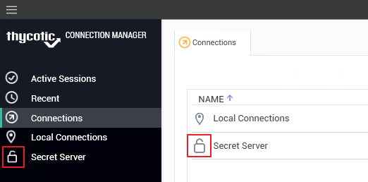

[title]: # (Re-authenticate)
[tags]: # (connection)
[priority]: # (2)
# Re-authenticate

When Connection Manager starts, the configured Secret Server connection are displayed under the Connections tab, but they are __not__ connected.

To re-authenticate an existing Secret Server connection, either

* double-click the __closed-lock icon__ in the navigation menu, or 
* on the Connections page, in the list right-click the connection you wish to open and select __Connect__.

  