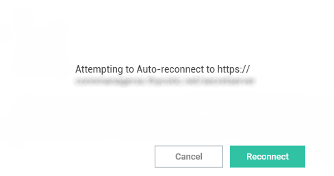

[title]: # (Re-authenticate)
[tags]: # (connection)
[priority]: # (2)
# Re-authenticate

When Connection Manager starts, the configured Secret Server connection are displayed under the Connections tab, but they are __not__ connected.

To re-authenticate an existing Secret Server connection, either

* double-click the __closed-lock icon__ in the navigation menu, or 
* on the Connections page, in the list right-click the connection you wish to open and select __Connect__.

  

If you lose your internet connection to Secret Server, Connection Manager makes multiple attempts to automatically reconnect and re-authenticate to Secret Server in the background. After 30 seconds, Connection Manager displays the dialog, **Attempting to Auto-reconnect to [Secret Server name]** for three more minutes and continues to attempt to reconnect. The dialog displays a **Cancel** button for users who wish to drop the connection, and a **Reconnect** button for users who wish to attempt to manually attempt to reconnect. If at any time during this period the Secret Server connection is regained, Connection Manager automatically reconnects and re-authenticates. If the period passes without reconnecting to Secret Server, the dialog closes, the Connect dialog opens, and the user must re-authenticate through Connection Manager when reconnecting to Secret Server. 

  
