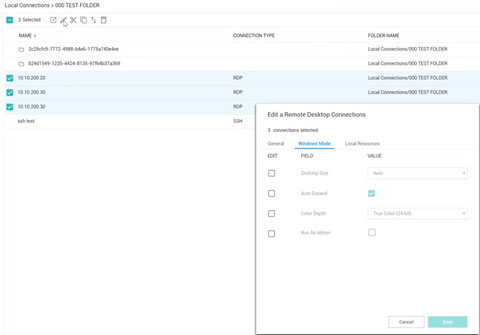
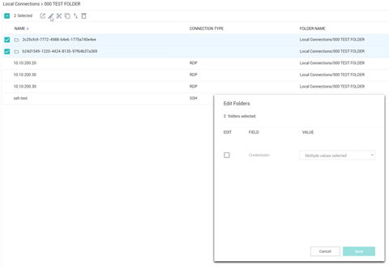

[title]: # (Batch Edit Connection)
[tags]: # (batch, edit, connection)
[priority]: # (508)
# Batch Edit Local Connections

In Connection Manager there are several ways to batch edit multiple RDP connections or multiple SSH connections. You cannot edit RDP and SSH connections together.

## Batch Edit Parameters for Local Connections Using Multi-select
You can batch edit parameters for multiple local connections (all RDP or all SSH) using multi-select.

1. Click to check the boxes for all connections you wish to batch edit.
   
1. In the toolbar click the __Edit__ icon.
1. Edit the settings you wish to apply to all of your selected connections and click __Save__.

## Batch Edit Credentials for All Connections in Multiple Folders
You can batch edit Credentials for all connections in multiple folders.

1. Click to check the boxes for the folders whose connections you wish to batch edit.
   
1. In the toolbar click the __Edit__ icon.
1. Edit the Credentials you wish to apply to all connections in your selected folders and click __Save__.
