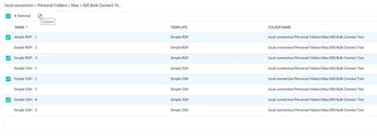
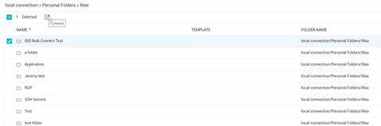
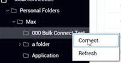

[title]: # (Batch Open Connections)
[tags]: # (batch, open, connection)
[priority]: # (508)
# Batch Open Connections

In Connection Manager there are several ways to simultaneously open multiple connections, including combinations of Secret Server and Local connections.

## Batch Open Connections Using Multi-select
You can batch open multiple Local and Secret Server Connections, even when they are in different folders

1. Click to check the box before each connection you wish to open
   
1. Click the Connect icon in the toolbar

## Batch Open All Connections in a Folder
You can batch open all connections in a folder, at the folder level.

1. Click to check the box before the folder whose connections you wish to open simultaneously.
   
1. Click the Connect icon in the toolbar

You can also open all connections in a folder by right-clicking the folder in the left-hand navigation and selecting Connect from the context menu

   
