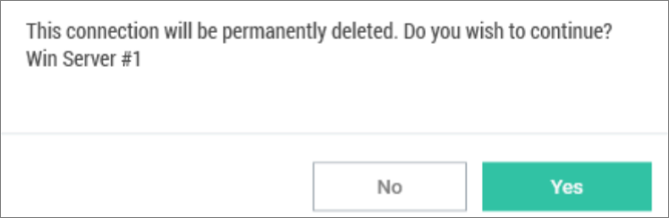

[title]: # (Delete Connection)
[tags]: # (delete, connection)
[priority]: # (504)

# Delete Connections from Remote Systems

A Local connection may be deleted from Connection Manager.

**Important**: This action is **not** reversible. Once a connection is deleted it cannot be recovered.

1.  Navigate to the connection to be removed.

2.  Right-click the **connection** and select **Delete**. A confirmation dialog box will open.

   

3.  Click **Yes** to confirm.
