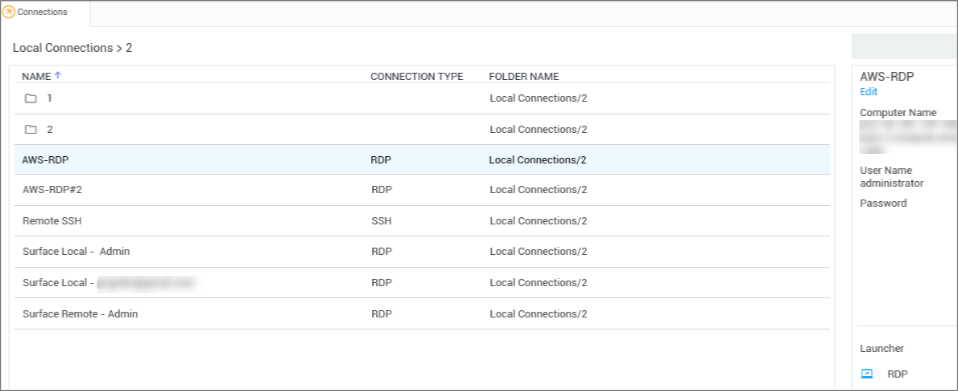

[title]: # (Edit Connection)
[tags]: # (edit, connection)
[priority]: # (504)

# Edit Connections to Remote Systems

1. Navigate to the connection to be edited and click the **connection name**.

  

1. In the Connection properties area, click the **Edit button** under connection name. An Edit dialog will open depending on the connection type.

2. Modify the fields as desired. (Most values in a local connection may be edited, except the required fields and the username field.)

3. Click **Save** when finished.