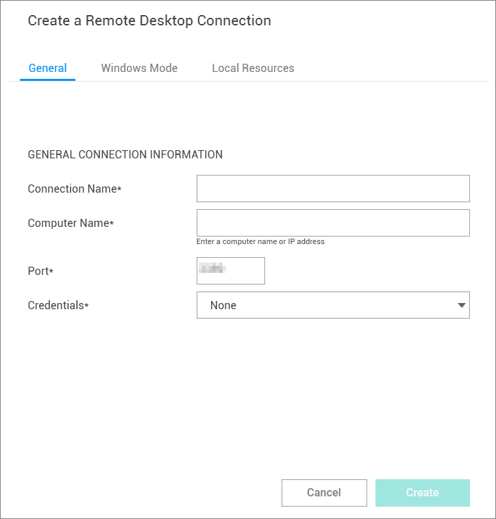
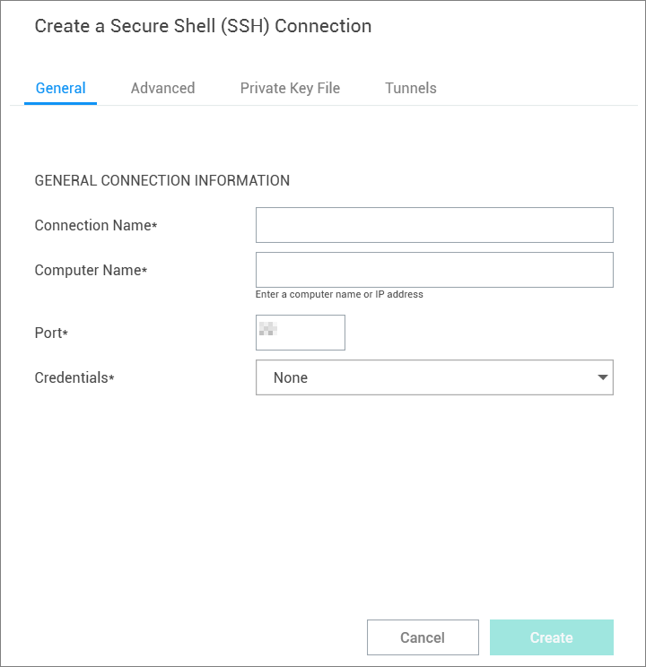

[title]: # (Connection to Remote Systems)
[tags]: # (connection, remote)
[priority]: # (502)

# Create a New Connection to Remote Systems

Connection Manager allows users to create new connections to remote systems and store them locally. Secret Server Secrets may only be viewed and initiated within Connection Manager.

All required fields and the appropriate optional fields must be filled out. If you choose not to enter a username and password, you will be prompted to enter this information when connecting. Many of the fields will have default values pre-entered. You may keep these values or modify them as appropriate.

1. From the Local connections section of the navigation tree, navigate to the **folder where the new connection will be created**.

2. Right-click the **folder name** and select **New Connection** followed by the **connection type** (RDP or SSH).

   Dependent upon the connection type (RDP or SSH), a dialog box will open. The options will vary based on the type of connection selected. View [Integrated Connections](#create-an-integrated-connection) for additional information on credentials.

   **RDP Connection**

      - **Connection Name**: Enter a friendly name for the new connection.

      - **Computer Name**: Enter the unique identifier for the computer name or IP address.

      - **Port**: Enter the port number for the connection or leave default.

      - **Credentials**: Select the appropriate credential for the new connection.

      

   **SSH Connection**

      - **Connection Name**: Enter a friendly name for the new connection.

      - **Computer Name**: Enter the unique identifier for the computer name or IP address.

      - **Port**: Enter the port number for the connection or leave default.

      - **Credentials**: Select the appropriate credential for the new connection.

      

   **Note**: The default value settings may be modified under the Configuration option.

3. Once all appropriate information is added, click **Create** to add the connection.