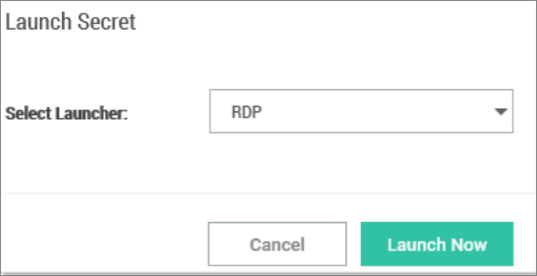
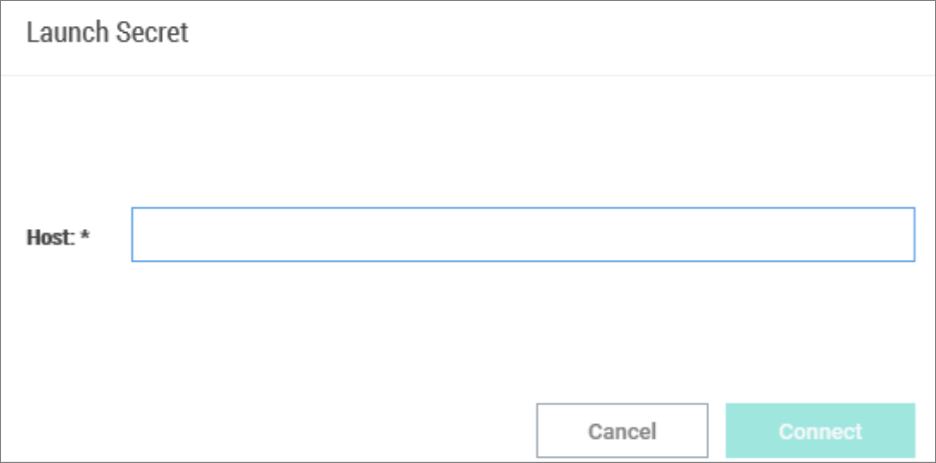
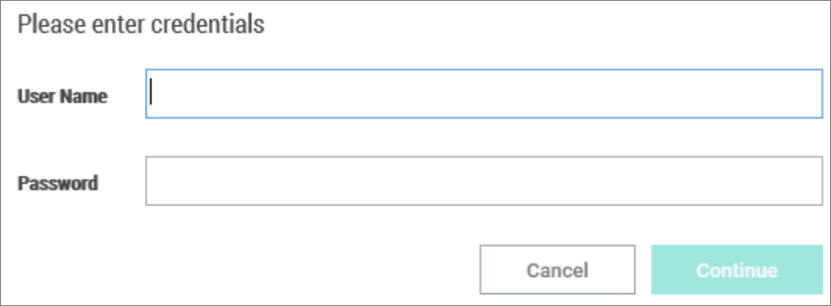

[title]: # (Open Connection)
[tags]: # (folder)
[priority]: # (506)

# Open a Remote Connection

The process of connecting to a Local connection or to a Secret from Secret Server is essentially the same.

1. Navigate to the remote connection. The remote session can be opened two ways:

   - In the main window, double-click the **connection name**. A new connection tab will open.

   - Select the **connection** to open the Properties tab. In the bottom half of the Properties window there is a section that lists available Launchers for use. Click the **desired launcher** and the session will open.

   Sessions launched from a Secret Server Secret may have workflows associated with the launching or closing of a session. If the connection requires no special workflow, the remote connection will be established as a new tab in the work area. If user entry is required for a workflow action, a window(s) will open prior to connecting so users can enter the appropriate or required data.

   **Note:** When connecting to a Secret with a whitelist, users will be prompted to enter a text value if the whitelist is empty.

2. Select a **launcher**. For Secrets where multiple launchers are available, you are prompted to select one.

   

3. Select a **Host** or **Machine ID**. For Secrets where a host is not specified, you are prompted to enter one.

   

4. Enter **user credentials**. For Connections or Secrets without an embedded username or password (or password), a dialog box opens (based on launcher type) to enter credentials.

   
