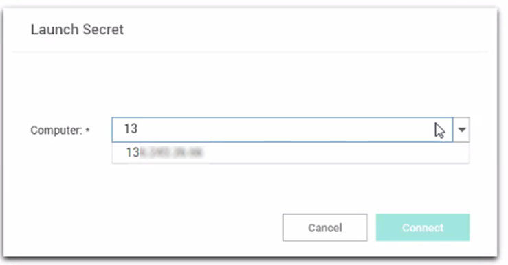

[title]: # (Open Connection)
[tags]: # (folder)
[priority]: # (506)
# Open a Remote Connection

The process of connecting to a Local connection or to a Secret from Secret Server is essentially the same.

1. Navigate to the remote connection. The remote session can be opened two ways:

   * In the main window, double-click the connection name. A new connection tab will open, or
   * Select the connection to open the Properties tab. In the bottom half of the Properties window there is a section that lists available Launchers for use. Click the desired launcher and the session will open.

     Sessions launched from a Secret Server Secret may have workflows associated with the launching or closing of a session. If the connection requires no special workflow, the remote connection will be established as a new tab in the work area. If user entry is required for a workflow action, a window(s) will open prior to connecting so users can enter the appropriate or required data.

   >**Note**: When connecting to a Secret with an Allowed List, users will be prompted to enter a text value if the list is empty.
1. Select a launcher. For Secrets where multiple launchers are available, you are prompted to select one.

   

   Click __Launch Now__.
1. Select a __Host__ or __Machine ID__. For Secrets where a host is not specified, you are prompted to enter a host machine name into a search box. As soon as enough characters are typed to generate at least a partial match, Connection Manager returns matching machines .

   

   Click __Connect__.
1. Enter user credentials. For Connections or Secrets without an embedded username and/or password, a modal opens (based on launcher type) to enter credentials.

   

   Click __Continue__.
