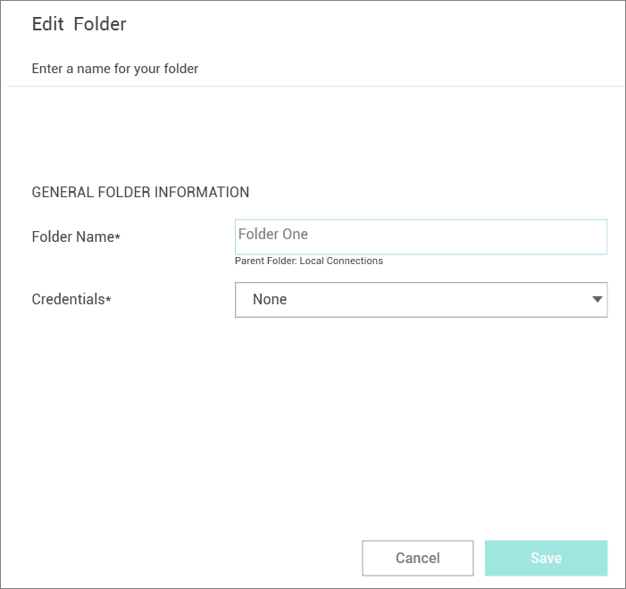

[title]: # (Folder: Create, Edit, Delete)
[tags]: # (folder)
[priority]: # (501)
# Create, Edit or Delete a Folder

## Create a New Folder

Connection Manager uses folders to help organize local connections.

1. Navigate to the location where a new folder should be created.
1. Right-click and select __New Folder__.

   
1. Enter the __Folder Name__ and click __Create__.
1. Choose the appropriate __credential option__ from the list:

   * __None__: No credential values will be set or required for the new folder.
   * __Local Credentials__: Allows a user to create the credentials for the new folder.
   * __Inherit from Folder__: Allows a user to set credentials for a sub-folder to imitate the folder in which it will reside.
   * __Map Secret__: Allows a user to apply secrets to the new folder.

View [Integrated Connections](connections/integrated-conn/index.md) for additional information on credentials.

## Edit a Folder

1. Navigate to the folder to be edited and right-click. The Edit Folder dialog box opens.

   

2. Make any desired change to the folder and click __Save__.

View the [Integrated Connections](connections/integrated-conn/index.md) section for additional information on credentials.

## Delete a Folder

When a folder is deleted, the folder and its contents (Local connections and other folders) are deleted.

>**Important**: This action is __NOT__ reversible. Once a connection is deleted it cannot be recovered.

1. Navigate to the folder to be deleted.
1. Right-click the __folder name__ and select __Delete__. A confirmation modal opens.

   
1. Select __Yes__ to confirm.
