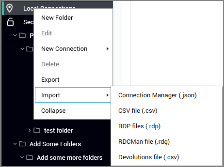

[title]: # (Import)
[tags]: # (user)
[priority]: # (501)
# Import of CSV Files

Connection Manager allows the import of Connection Manager .JSON, CSV, and RDP files for local connections data.

1. Right-click on __Local Connections__.
1. Select __Import__.

   
1. Select from the import options available based on your source file.

## Importing Local Connection Data

The following example shows what to expect when importing local connections into your Connection Manager instance.

1. 
