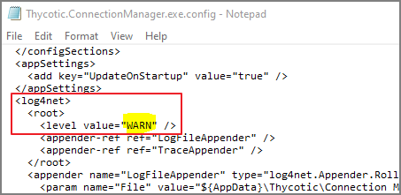

[title]: # (Log Files)
[tags]: # (user)
[priority]: # (501)

# Log Files

The Connection Manager log files can be found at the following default locations.

## Windows Log File Location

`C:\Users\Administrator\AppData\Roaming\Thycotic\Connection Manager`

### Changing the Log Level

On Windows system the default log level can be changed via the __Thycotic.ConnectionManager.exe.config__ file. Under _log4net_ search for the default __WARN__ level and change it to __DEBUG__ for detailed troubleshooting logging.



## MacOS Log File Location

Catalina: `~/Library/Application Support/Thycotic/Connection Manager/ConnectionManager.log`

### Changing the Log Level

On macOS you change the logging level of Connection Manager's logs to DEBUG mode by opening __Terminal__ and type:

```bash
defaults write com.Thycotic.ConnectionManager FileLogLevel 'Debug'
```
