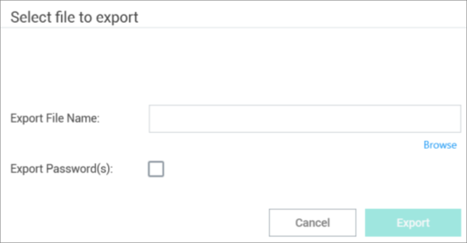

[title]: # (Export Connections)
[tags]: # (export, connect, secret server)
[priority]: # (304)

# Export Connections

Export allows users to export all local connections. When a folder is selected, the contents of that folder, along with any subfolders (and their contents), are included in the export file.

To initiate an export, perform the following:

1. On the Navigation menu, click the **desired folder or connection** under the Local connection section. Alternatively, the Local connection or folder may be selected in the main window.

2. Right-click and select **Export**. The Select file to export window opens.

   

3. Click **Browse** and enter **the location and file name** for export.

   **Note**: If Export Password(s) is selected, passwords for the connections is exported in **clear text**.

4. Click **Export** to complete the action.

The Import option is only available for Local connections and can only be accessed from the Navigation tree.
