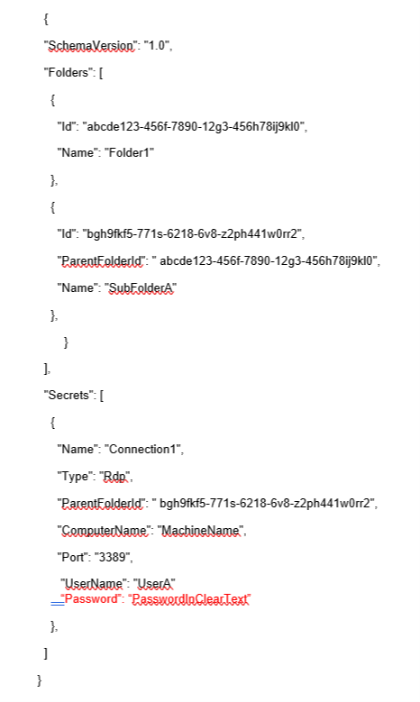

[title]: # (Import Connections)
[tags]: # (import, connect, secret server)
[priority]: # (305)
# Import Connections

The Import option is only available for Local connections and can only be accessed from the Navigation tree.

To initiate an import, perform the following:

1. On the Connection Manager navigation tree, select the __Local Connection folder__ to which the contents should be imported.
1. Right-click and select __Import__. A file browser window opens.
1. Navigate to the location of the .JSON file containing the content for import.
1. Select the .JSON file and click __Open__. The Connections are imported.

## JSON Example

The contents of any Export or Import file is in JSON format. The following is an example of the formatting:

>**Note**: The red text for the password field indicates that this part of the JSON file will only be included if the Export Password(s) option is used.
