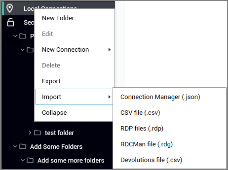
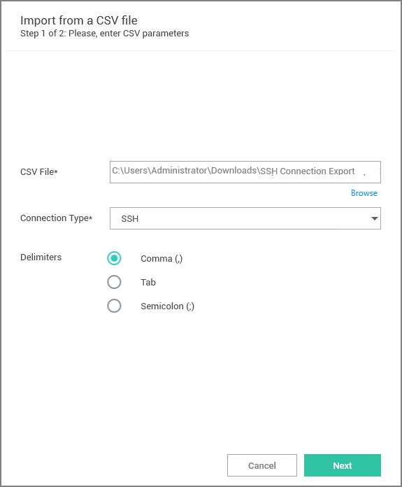
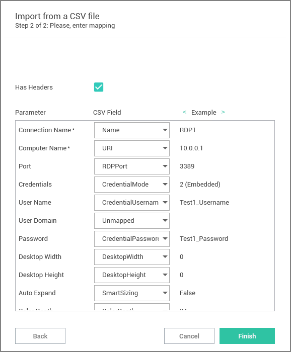
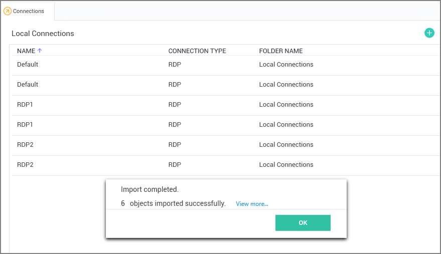
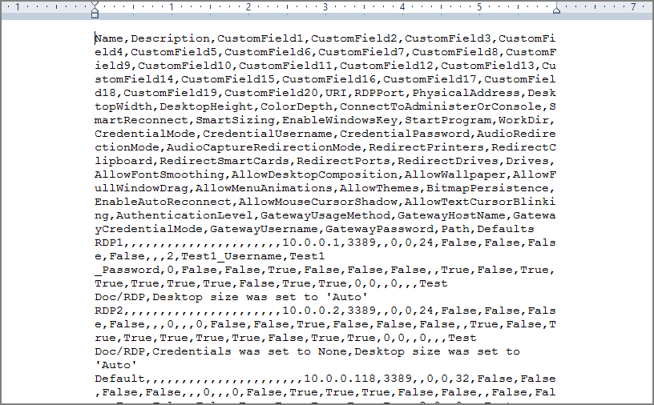
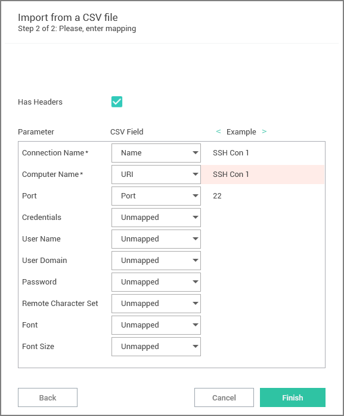

[title]: # (CSV Import)
[tags]: # (user)
[priority]: # (501)
# Import of CSV Files

Connection Manager allows the import of Connection Manager .JSON, CSV, and RDP files for local connections data.

This example is for CSV file imports.

1. Right-click on __Local Connections__.
1. Select __Import__.

   
1. Select from the import options available based on your source file.

## Importing Local Connection Data

The following example shows what to expect when importing local connections via CSV file into your Connection Manager instance.

1. In Step 1 of 2 of the Import process,
   1. select the file to import,
   1. specify the connection type, and
   1. select which Delimiters are used in the import file, the default is comma separated.

   
1. Click __Next__.

   

   By default Connection Manager maps the data from the import file to field mappings for the local connection information. Any data not recognized/mapped is indicated as unmapped and duplicate mappings are highlighted red. These potential errors can be fixed prior to the import.
1. Click __Finish__.

   

   Each connection in the file is imported as a Local Connection. Links to informational or error reports will be displayed, but only if the import encountered errors or if it automatically mapped fields during the import.
1. To further examine which information failed to import, click __View more...__.

   

   Connection Manager saved the connection data that failed to import in a separate file. The data can be edited and the file can be used to retry the import for the remaining connections.
1. Back in the Connection Manager UI, click __OK__ to close the __Import completed__ modal.

Example of Step 2 of 2 modal showing errors:

## Import Completed Reports

Imports and trigger none, one, or up to two reports.

* Successful: This report lists all objects that have been successfully imported.
* Not imported: This report lists all objects that failed to import. The report can be used to remediate the import issue(s) and the remaining connections can be reimported.

## CSV Import Differences

If you are working with Devolutions type connection .csv files, do not use the standard .csv import option. Devolutions .csv files require a different mapping scheme than standard .csv.
