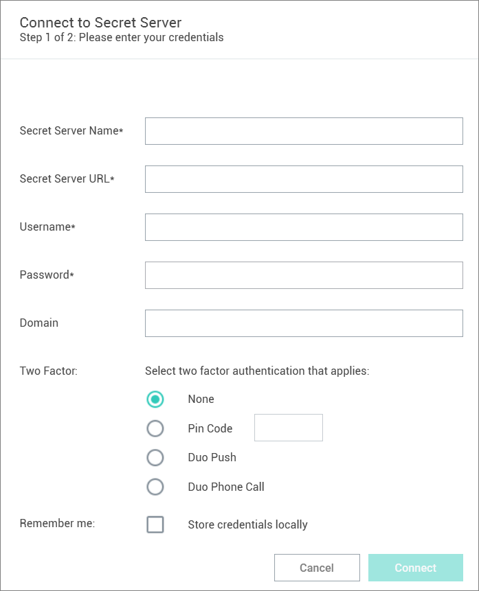
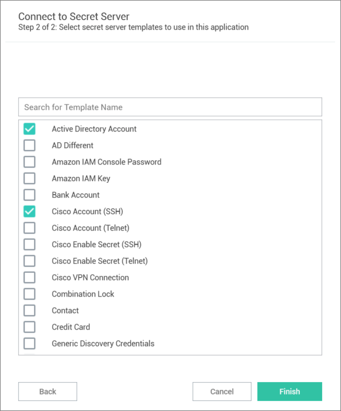

[title]: # (Connect to Secret Server)
[tags]: # (connect, secret server)
[priority]: # (300)
# Connect to Secret Server

Connection Manager will only connect to Secret Server version 10.7 or later and requires a valid Secret Server license.

1. On the Configuration menu, select __Secret Server Connections__. 

   If no Secret Server connections exist in Connection Manager, selecting the Secret Server Connections option opens to _Step 1: Connect to Secret Server_. If other Secret Server connections exist, the Secret Server Connections window opens instead.

1. On the __Secret Server Connections__ window select __Add a Connection__. The Secret Server connection wizard opens.

   
   1. Complete Step 1 required fields, including:

      * __Secret Server Name__: A friendly name for the connection.
      * __Secret Server URL__: The URL for the Secret Server instance, usually `https://<Server Name>/SecretServer`.
      * __Username__: The username for the Secret Server instance to which you want to login. (This is NOT the "username@company.com" format.)
      * __Password__: The password for the account.
      * __Domain__: The Secret Server environment. If this environment has been given a specific Domain value for login, enter the same value here.
      * __Two Factor__: Select the appropriate two-factor authentication option for your environment.
      * __Remember me__: Select this check box if you want Connection Manager to remember the credentials you entered. This option stores the credentials in local storage and encrypts them using your application password.

   >**Note**: Even if the *Remember me* option is selected, a user will still need to authenticate back to Secret Server when the application launches or times out.
1. After the required fields have been entered click __Connect__. Step 2 of the wizard opens.

   

   In Step 2, the system automatically fetches a list of Secret templates from the Secret Server URL entered in Step 1. The most common templates for RDP and SSH sessions are selected by default. You may select and deselect additional templates as needed, and you may also search for a specific template by name.
1. Click __Finish__ once all desired templates have been selected. The connection is added and appears in the navigation menu with a Lock icon to the left.

>**Note**: Secret Server connections will persist between sessions of Connection Manager; however, users must re-authenticate the connection after the application is launched, or following a session timeout.
