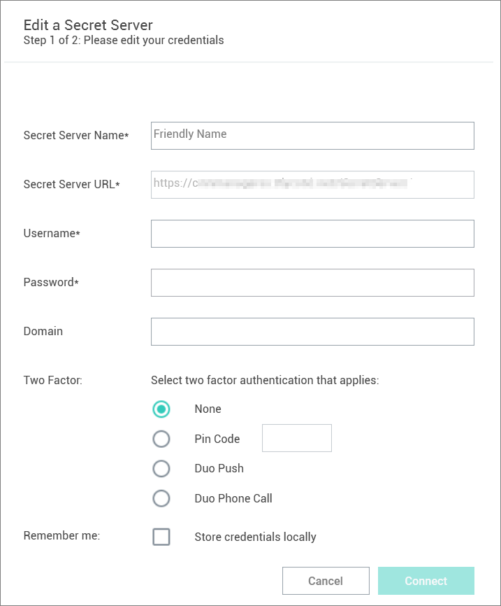
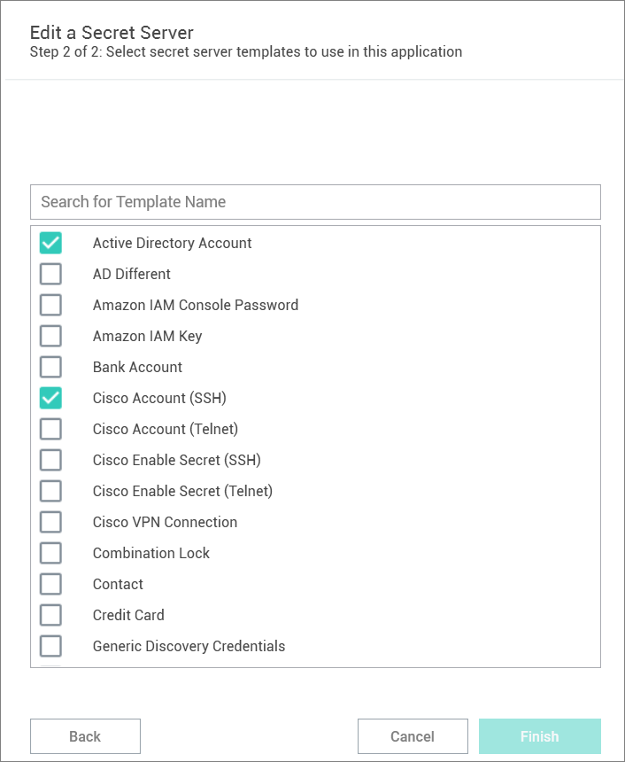
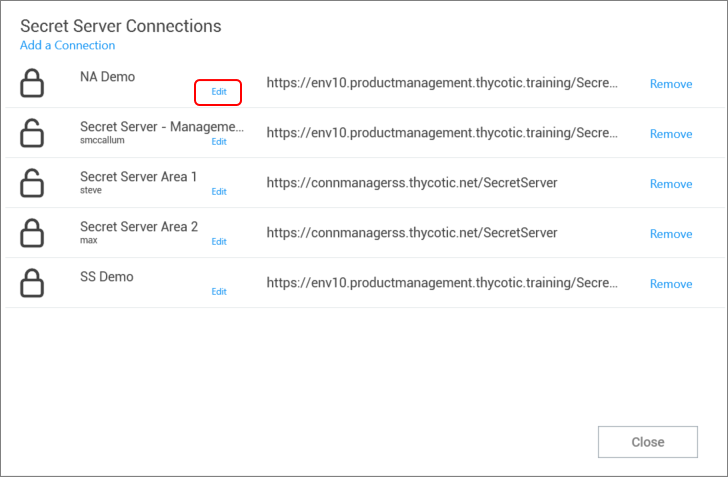

[title]: # (Modify a Connection)
[tags]: # (modify, connect, secret server)
[priority]: # (301)
# Modify a Connection

Existing connections to Secret Server can be modified. Most fields can be modified except for the Secret Server URL field:

1. On the Configuration menu, select __Secret Server Connections__. The Secret Server Connections window opens.
1. Click __Edit__ next to the Secret Server connection to be modified. The Edit text is between the Connection name and the URL value. The Connection dialog box opens.

   

   >**Note**: Users can make modifications to any of the fields here except for the Secret Server URL. If the *Remember me:* option was selected previously, the user will not be able to change the Username value either.
1. Make any desired changes in Step 1 and click __Connect__.

   
1. Make any desired changes in Step 2 and click __Finish__.

   >**Note**: A user may modify template selections at any time by selecting __Edit__ next to the Secret Server connection as shown below.

   