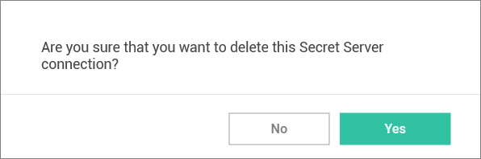

[title]: # (Remove a Connection)
[tags]: # (remove, connect, secret server)
[priority]: # (302)
# Remove a Connection

To remove a connection:

1. On the Configuration menu, select __Secret Server Connections__. The Secret Server Connections window opens.
1. Click the __Remove__ text to the far right of the Secret Server connection to be removed. A warning prompt will ask you to confirm.

   
1. Click __Yes__ to confirm.
