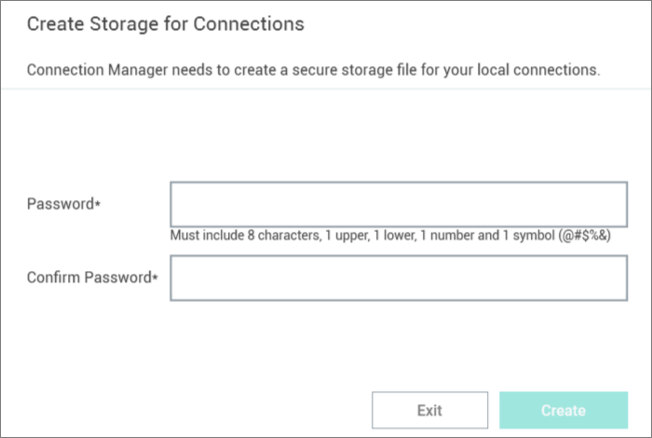

# Getting Started

Connection Manager creates a local encrypted file storage for saving local connections and Secure Server(s) connectivity information. 

## Create Password and Storage

When Connection Manager is launched for the first time, or if no file storage is detected, you must create a secure password for this vault.

**Important**: **If this password is lost, the saved connections are not recoverable and will have to be reentered.**

When starting the application after entering the local password, the following window appears. 

1. Enter the **password** to start the application.

2. **Reenter** to confirm password and click **Create**.

**Note**: If a local storage file exists but a user wishes to create a new one, click **Create new local storage file link**  in the lower left of the window. This will overwrite any existing storage file and any data stored there.