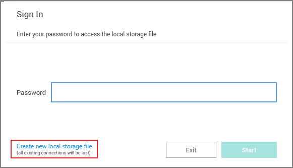
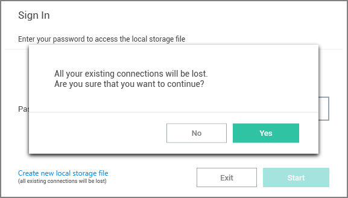

[title]: # (Sign-in)
[tags]: # (create, password)
[priority]: # (201)
# Sign in into Connection Manager

When opening Connection Manager locally on your system, you are presented with a Sign-in modal.

1. Enter the password you previously created.
1. Click __Start__.

You can choose to __Create new local storage file__, however that will remove all existing connections for your system.

