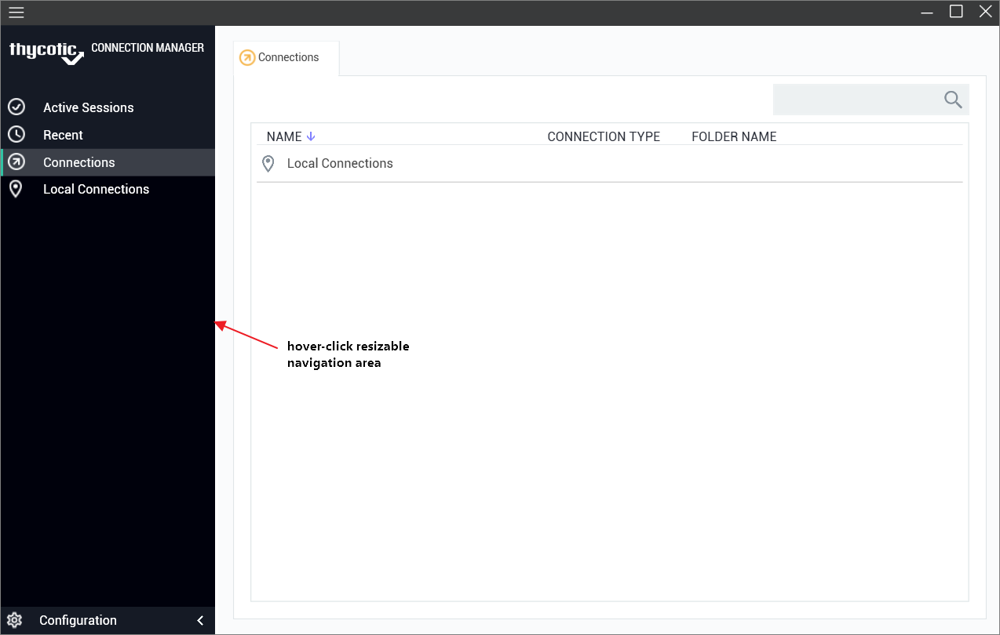

[title]: # (Main Screen)
[tags]: # (ui, main screen)
[priority]: # (203)

# Main Screen

The main screen consists of two components: the navigation tree (which may be minimized) on the left and the tabbed work area to the right. The two sections work in concert with each other.

