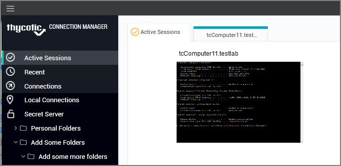
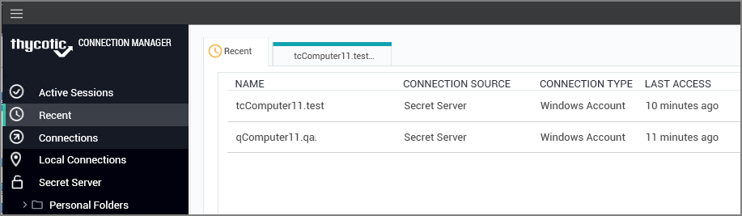
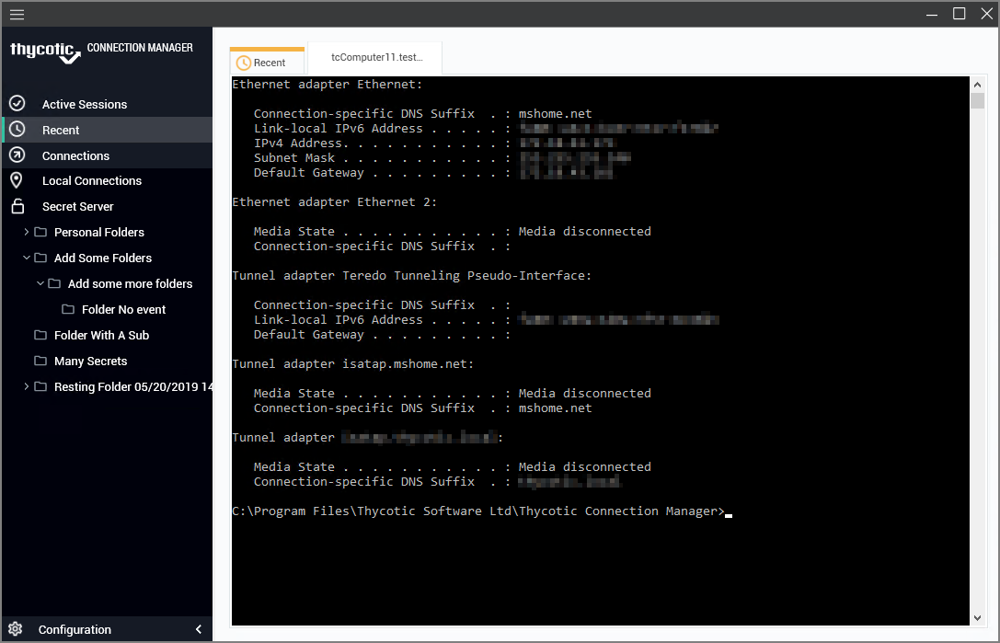
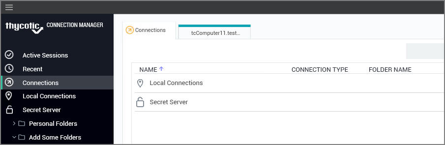
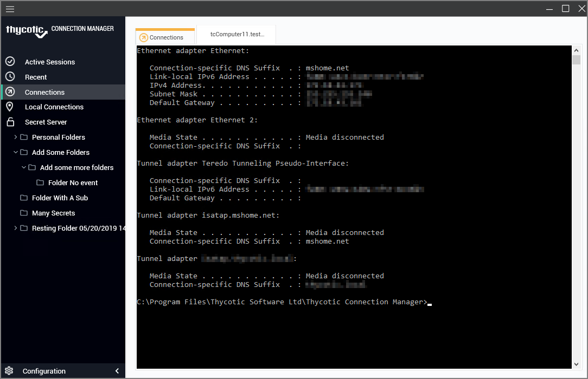

[title]: # (Navigation Tree)
[tags]: # (ui, navigation)
[priority]: # (204)
# Navigation Tree

## Active Sessions

Select to view all active sessions.

## Recent

Select to view or launch recently active sessions or to create a new Secret Server connection.

Existing entries also display connection type. These can be viewed via tab.

## Connections

Select to display the folder tree for Local and Secret Server connections.

Navigate using the tree, or drill-down through folders to display in the work area window. Existing connections can be viewed via tab.

## Local Connections

Select to view all local connections.

## Configuration

Clicking within this area brings up a sub-menu with options such as 

* Secret Server Connections and
* Global Configurations.

The __<__ can be used to collapse and __>__ expand the Navigation menu.
