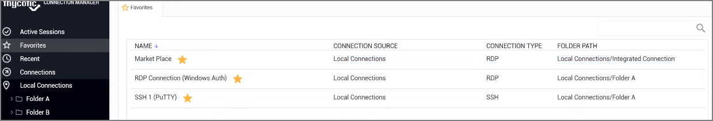
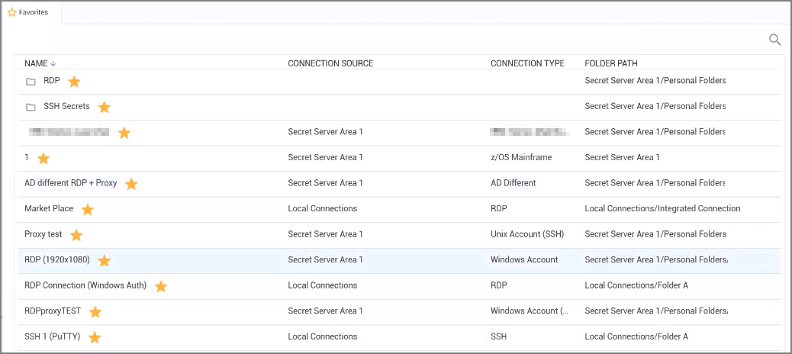
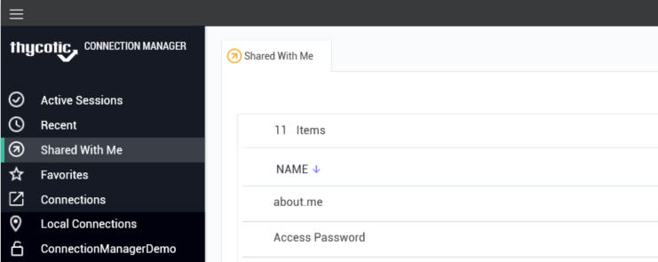

[title]: # (Navigation Tree)
[tags]: # (ui, navigation)
[priority]: # (204)
# Navigation Tree

## Active Sessions

Select to view all active sessions.

## Favorites

You can add favorite connections by hovering over an existing connection and selecting the star. Favorites that are specified in Connection Manager will also be listed as favorites in Secret Server and vice versa.

Favorites page showing only local connection favorites:

Favorites page showing local and Secret Server connection favorites:

## Shared With Me

Select to view or launch all secrets and sessions shared with you from all currently connected secret servers.

Double clicking on these Secrets will launch sessions.

## Recent

Select to view or launch recently active sessions or to create a new Secret Server connection.

Existing entries also display connection type. These can be viewed via tab.

## Connections

Select to display the folder tree for Local and Secret Server connections.

Navigate using the tree, or drill-down through folders to display in the work area window. Existing connections can be viewed via tab.

## Local Connections

Select to view all local connections. In this view, you can drag and drop folders to organize them logically.

## Shared with me

Select to view all secrets/sessions shared with you from a Secret Server connection. You can double-click these Secrets to launch sessions for them.

## Configuration

Clicking within this area brings up a sub-menu with options such as 

* Secret Server Connections and
* Global Configurations.

The __<__ can be used to collapse and __>__ expand the Navigation menu.
