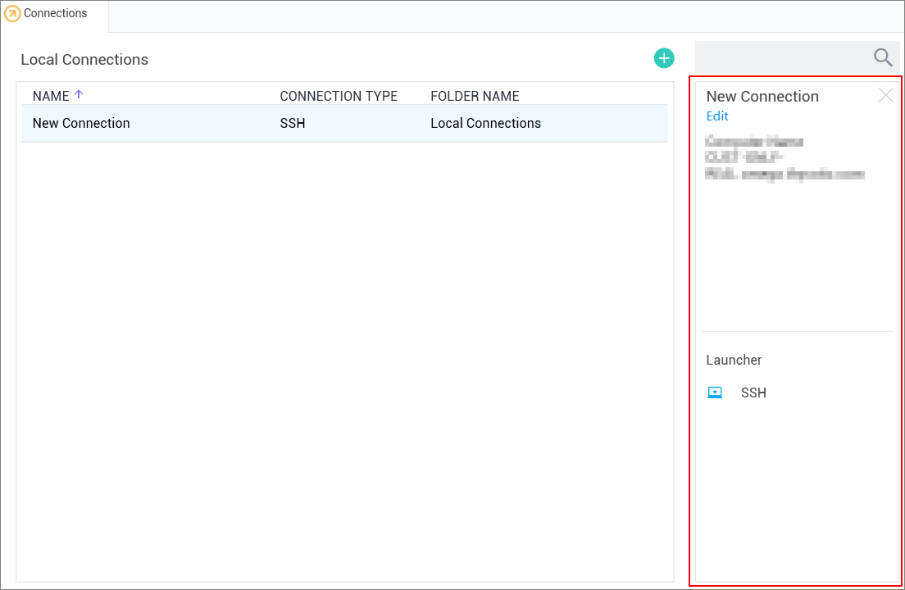

[title]: # (Properties Area)
[tags]: # (ui, properties area)
[priority]: # (206)
# Properties Area

All Local connections, Secret Server connections, and folders have a Properties section. This section allows a user to view some of the details of the connection and folder and allows users to perform functions on the selected object, such as launching a connection, editing properties, or viewing passwords.

>**Note**: The Properties section for a Secret Server Secret will never display, or have an option to display, the password for that Secret.
