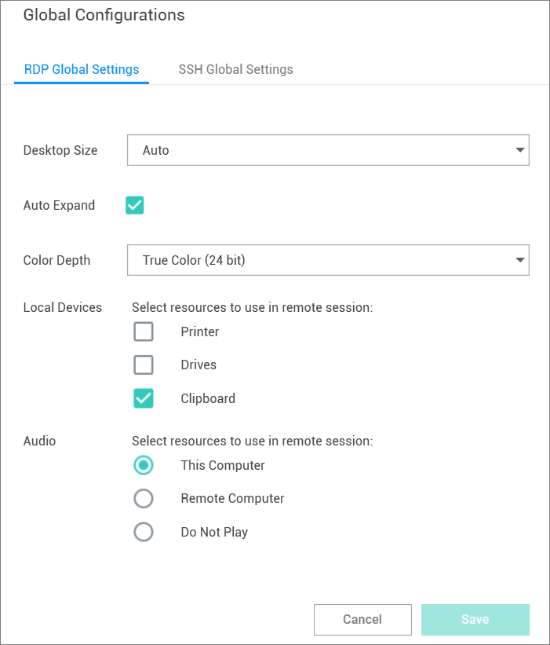

[title]: # (Configure Global Settings)
[tags]: # (configure, global, settings)
[priority]: # (400)
# Configure Global Settings

Global Settings allows a user to control default parameter values when creating Local connections. To access:

1. On the Configuration menu, click __Global Settings__. The Global Configurations dialog box opens.

   

The available options are accessible via tab controls and include RDP Global Settings and SSH Global Settings:

* These default options may be overridden within the individual connections.
* Connections from Secret Server do not support all available parameters. In such cases the default parameters will be substituted.
* Any of the default configuration values that are specified in a Secret, from a Secret Server connection, will use the values from the Secret instead of the Global Configurations.

## Globally Enforced Secret Server Settings

The following settings can be configured in Secret Server and will be applied globally for any Connection Manager application that is connected to it.

To access this in Secret Server, 

1. Navigate to __Admin | See All__.
1. Select __Tools & Integrations__.

   

These options are by default enabled:

* Allow Local Connections – Allows or disables saving credentials for any Local Connections. The default is Yes.

  
* Allow Saving Credentials - Allows or disables saving credentials for any Secret Server connections. The default is Yes.

  

If Connection Manager is connected to multiple Secret Server Instances, and those instances have different values for these new settings, then Connection Manager will always use the more secure option set for security purposes. For example, if Connection1 allows Local Connections, and Connection2 does not allow Local Connection, then Connection Manager will not allow Local connections at all.

If you already have Local Connections saved, and the __Allow Local Connection__ option is set to No, then the next time the Secret Server instance is connected to the Connection Manager instance we will prompt the user to tell them the Local Connections will be deleted. If they agree, then Secret Server connects and the local connections are deleted. If they say No, then we prevent Secret Server from connecting

The behavior is the same for saving credentials when setting the __Allow Saving Credentials__ flag.
