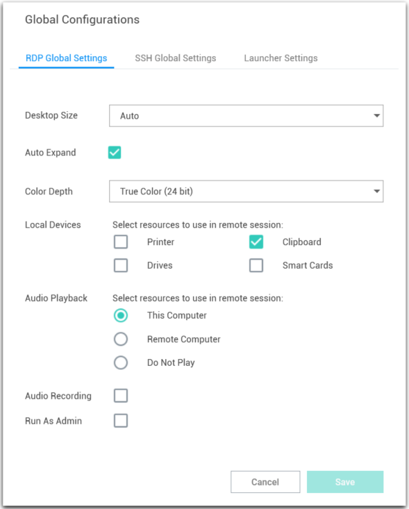
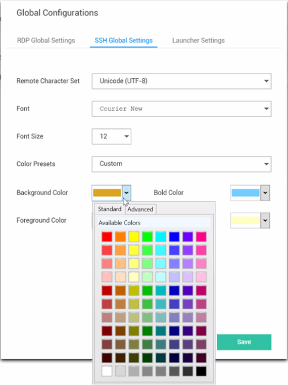
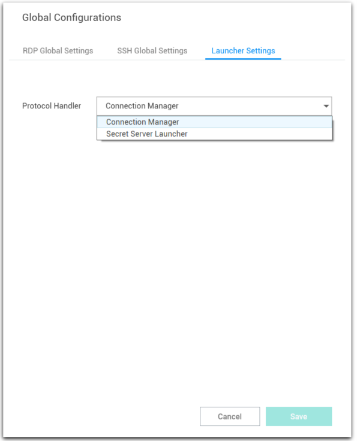
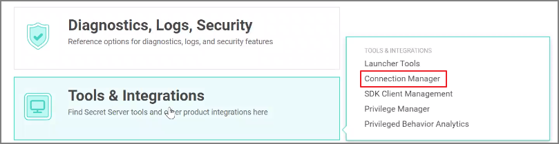
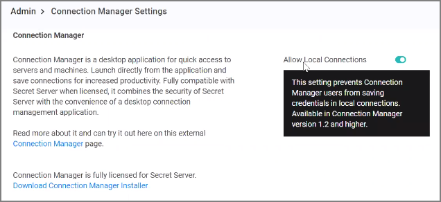
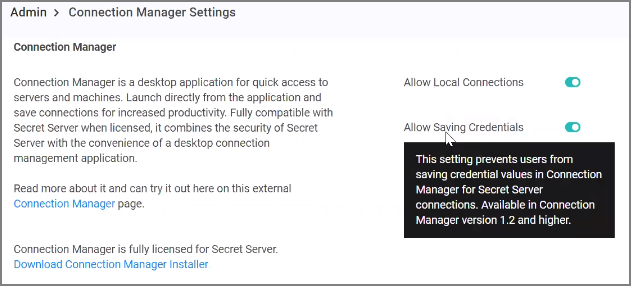
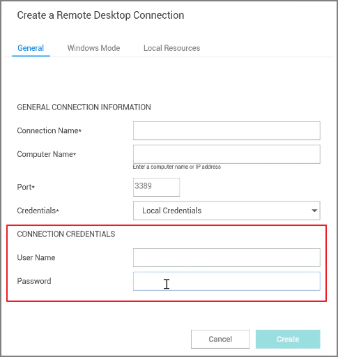
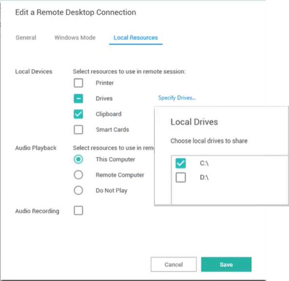

[title]: # (Configure Global Settings)
[tags]: # (configure, global, settings)
[priority]: # (400)

# Configure Global Settings

Global Settings allows a user to control default parameter values when creating Local connections. All default options may be overridden within the individual connections. Connections from Secret Server do not support all available parameters. In such cases the default parameters will be substituted. Any of the default configuration values that are specified in a Secret from a Secret Server connection, will use the values from the Secret instead of the Global Configurations.

On the Configuration menu, click __Global Configurations__. The Global Configurations dialog box opens to the **RDP Global Settings** tab, where you can configure settings such as **Desktop Size**, **Color Depth**, and **Local Devices**.

   

On the **SSH Global Settings** tab, you can configure settings such as **Font** and **Font Size**. You can choose one of the **Color Presets** or you can create a Custom color scheme by changing the individual values for **Backgound Color**, **Foregound Color**, **Bold Color**, or **Underlined Color**. 

   

On the **Launcher Settings** tab, administrators can choose to use the Connection Manager protocol handler or the legacy protocol handler, Secret Server Launcher. Users can also switch between the two protocol handlers. If both protocol handlers are installed and the administrator uninstalls one of them, the other protocol handler will register itself as the protocol handler for all users on installation. 

   

## Globally Enforced Secret Server Settings

The following settings can be configured in Secret Server and will be applied globally for any Connection Manager application that is connected to it.

To access this in Secret Server, 

1. Navigate to __Admin | See All__.
1. Select __Tools & Integrations__.

   

These options are by default enabled:

* Allow Local Connections – Allows or disables saving credentials for any Local Connections. The default is Yes.

  
* Allow Saving Credentials - Allows or disables saving credentials for any Secret Server connections. The default is Yes.

  

If Connection Manager is connected to multiple Secret Server Instances, and those instances have different values for these new settings, then Connection Manager will always use the more secure option set for security purposes. For example, if Connection1 allows Local Connections, and Connection2 does not allow Local Connection, then Connection Manager will not allow Local connections at all.

If "Allow Local Connections" is set to "off" and user imports local connection(s), credentials are not imported but the local connections are created.

If you already have Local Connections saved, and the __Allow Local Connection__ option is disabled, then the next time the Secret Server instance is connected to the Connection Manager instance we will prompt the user that the Local Connections will be deleted. If they agree, then Secret Server connects and the local connections are deleted. If they say No, then we prevent Secret Server from connecting.

The behavior is the same for saving credentials when setting the __Allow Saving Credentials__ flag.

When creating or editing a Remote Desktop Connection, you can select and map the local drives you wish to share. On the **Local Resources** tab, click **Drives** and then click **Specify Drives**. Select the drives you wish to map and deselect any drives you don't want to map. If you choose to map all available local drives, the **Drives** box displays a check mark. If you decide to map only some of the available local drives, the **Drives** box displays a dash.

  
