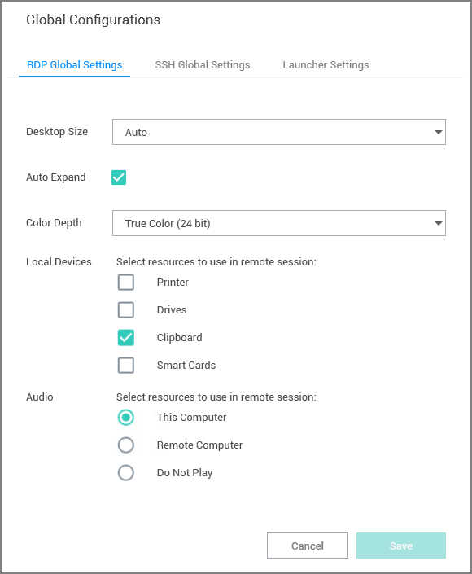

[title]: # (Configure Global Settings)
[tags]: # (configure, global, settings)
[priority]: # (400)
# Configure Global Settings

Global Settings allows a user to control default parameter values when creating Local connections. To access:

1. On the Configuration menu, click __Global Settings__. The Global Configurations dialog box opens.

   

The available options are accessible via tab controls and include RDP Global Settings and SSH Global Settings:

* These default options may be overridden within the individual connections.
* Connections from Secret Server do not support all available parameters. In such cases the default parameters will be substituted.
* Any of the default configuration values that are specified in a Secret, from a Secret Server connection, will use the values from the Secret instead of the Global Configurations.

## Globally Enforced Secret Server Settings

The following Secret Server settings allow to globally enforce changes for Connection Manager applications that are connected:

* Allow Local Connections – Allows or disables saving credentials for any Local Connections. The default is Yes.
* Allow Saving Credentials - Allows or disables saving credentials for any Secret Server connections. The default is Yes.
