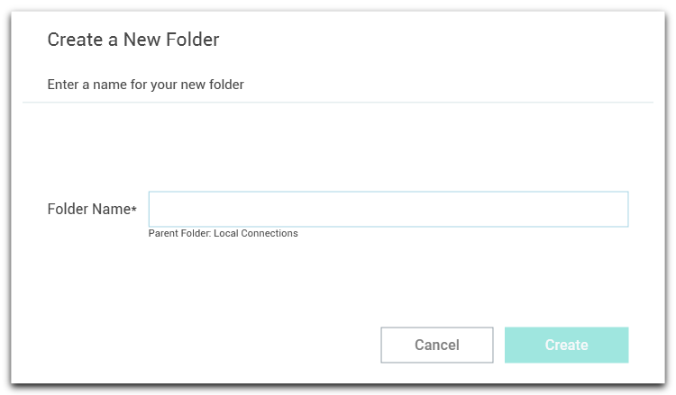

[title]: #	(Create a New Folder)
[tags]: #	(create,folders)
[priority]: #	(403)
# Create a New Folder

Connection Manager uses folders to help organize your local connections.  

1. Navigate to the **location where a new folder should be created**. 

2. Right-click and select **New Folder**. 

3. Enter the **Folder Name** and click **Create**.