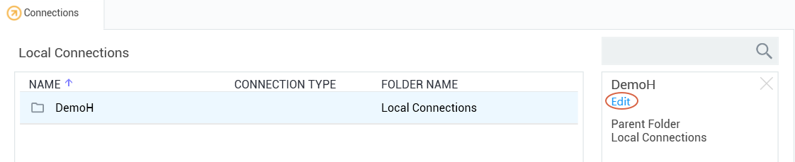

[title]: #	"Edit a Folder"
[tags]: #	"edit,folders"
[priority]: #	"405"
# Edit a Folder

1. Navigate to the **folder to be edited** and select it in the main window. 

2. From the Folder properties area, click the **Edit** option. 

3. From the Edit options, make any desired change to the folder, and click **Save**.

