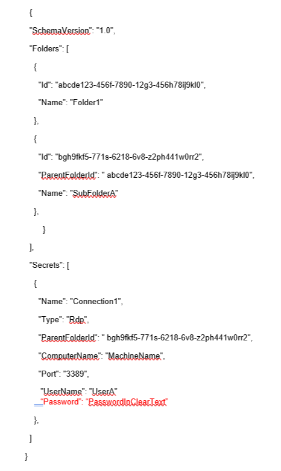

# Import/Export

Import/Export allows users to export all Local connections. When a folder is selected, the contents of that folder along with any subfolders (and their contents) will be included in the export file.

### File Format for Import/Export

The contents of any Export or Import file need to be in JSON format. The following is an example of the formatting:

**Note**: The red text for the password field indicates that this part of the JSON file will only be included if the Export Password(s) option is used.  

## Import

The Import option is only available for Local connections and can only be accessed from the Navigation tree. To initiate an import, perform the following:

1. From the Connection manager navigation tree, select **the Local Connection folder** to which the contents should be imported. 
2. Right-click and select **Import**. A file browser window will open. 

3. Navigate to the location of the JSON file containing the content for import. Select and click **Open**.

## Export

To initiate an **export,** perform the following:

1. From the Navigation menu, click the **desired folder or connection** under the Local connection section. Alternatively, the Local connection or folder may be selected in the main window as well.

2. Right-click and select **Export**. The **Select file to export** window will open. 

3. Click **Browse** and enter **the location and file name** for export.

**Note**: If Export Password(s) is selected, passwords for the connections will be exported in **clear text**.

4.    Click **Export** to complete the action.

