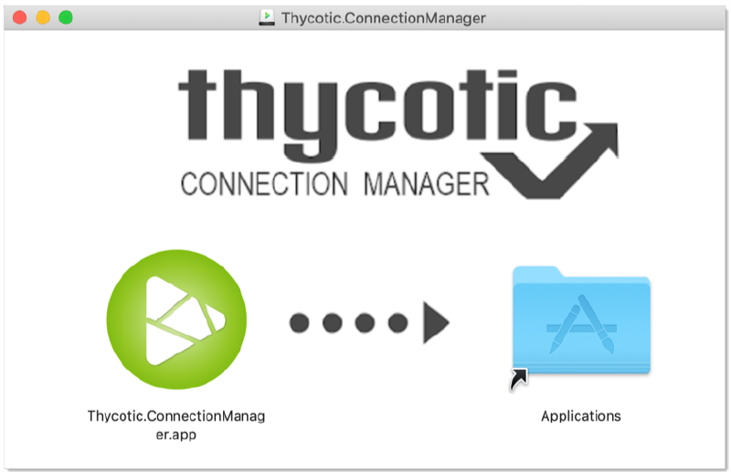
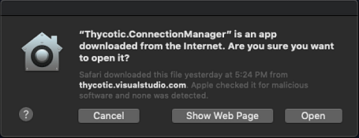

[title]: # (Apple OSX Installation)
[tags]: # (apple,cm,install)
[priority]: # (102)

# Apple OSX Installation

1. Download the DMG file from Thycotic’s [Free Tools](https://thycotic.com/solutions/free-it-tools/connection-manager-free/) page.

2. Select **Mac** download. A DMG file will download to your system.

3. Navigate to the DMG file and double-click to open, or right-click and select **Open**. The install window opens.

4. Click, drag, and drop the Thycotic Connection Manager logo to the Applications folder. The installation begins.

   

5. Once Connection Manager has been added, close the installer window.

**Note**: If you receive the following message on your install, click **Open**.

