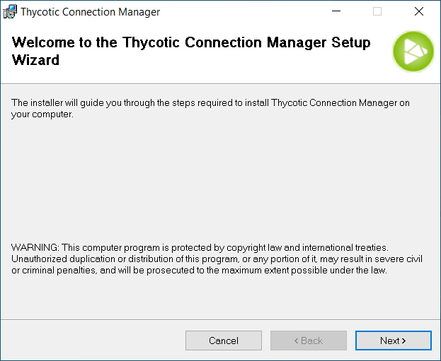
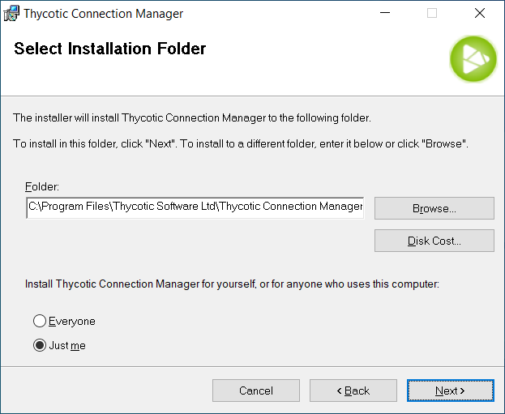
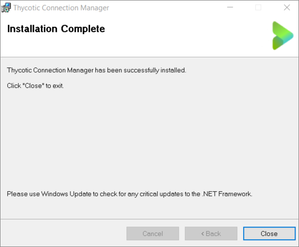

[title]: # (Windows Installation)
[tags]: # (install,windows,setup)
[priority]: # (101)

# Windows Installation

1. Download the **[Windows Installer File (MSI)](https://downloads.cm.thycotic.com/Thycotic.ConnectionManager.WindowsInstaller.msi)** for Connection Manager.

2. Double-click the MSI file to start the install process and click **Next** to continue.

   

3. Select the **location to install Connection Manager** or leave the default location.

   **Note:** The user may also choose to allow anyone on the machine to run Connection Manager, or it may only be accessible to the current user. To make it available to everyone, select the **Everyone** radio button. To make it available only to the current user account, select **Just me**.

   

4. Click **Next** to confirm the location and accessibility for the install.

5. Click **Next** again to start the installation. A progress bar will be displayed while the installation is in progress.

6. Once the install has finished, click **Close**.

   

The install is complete, and the Connection Manager icon will be added to the desktop for easy access.

When the Connection Manager application is launched, users are prompted with an update message if a new release is available. If you would like to update, click the **Update** button.