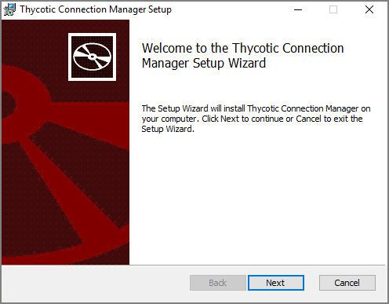
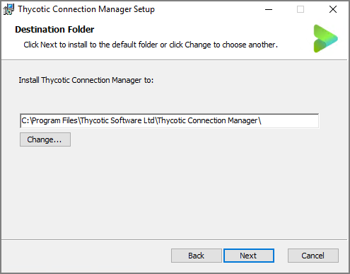
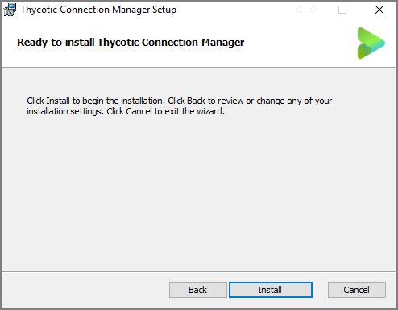
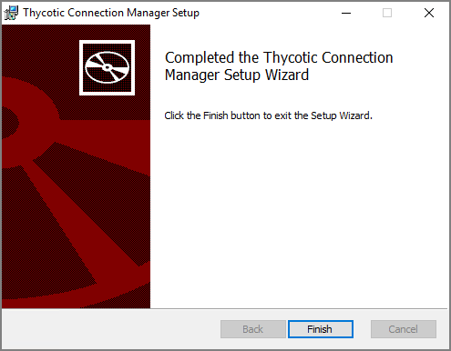
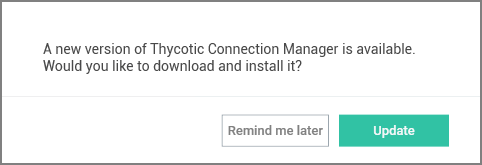

[title]: # (Windows Installation)
[tags]: # (install,windows,setup)
[priority]: # (110)
# Windows Installation

>**Note**: On Windows systems when you are upgrading to Connection Manager 1.3.0 only, do not follow the in product update option. Instead uninstall your current version of Connection Manager (make sure to backup/export your local connections first), then install the new 1.3.0 version of Connection Manager. This is only a one-time issue when upgrading from previous Connection Manager versions to the release 1.3.0 version.

1. Download the [Windows Installer File (MSI)](https://downloads.cm.thycotic.com/Thycotic.ConnectionManager.WindowsInstaller.msi) for Connection Manager.
1. Double-click the MSI file to start the install process.

   
1. Click **Next** to continue.

   
1. Select the **location to install Connection Manager** or leave the default location.
1. Click **Next** to confirm the location and accessibility for the install.

   
1. Click **Next** again to start the installation. A progress bar will be displayed while the installation is in progress.

   
1. Once the install has finished, click **Finish**.

The install is complete, and the Connection Manager icon will be added to the desktop for easy access.

## Updates

When the Connection Manager application is launched, users are prompted with an update message if a new release is available. If you would like to update, click **Update** or choose to be reminded later.

