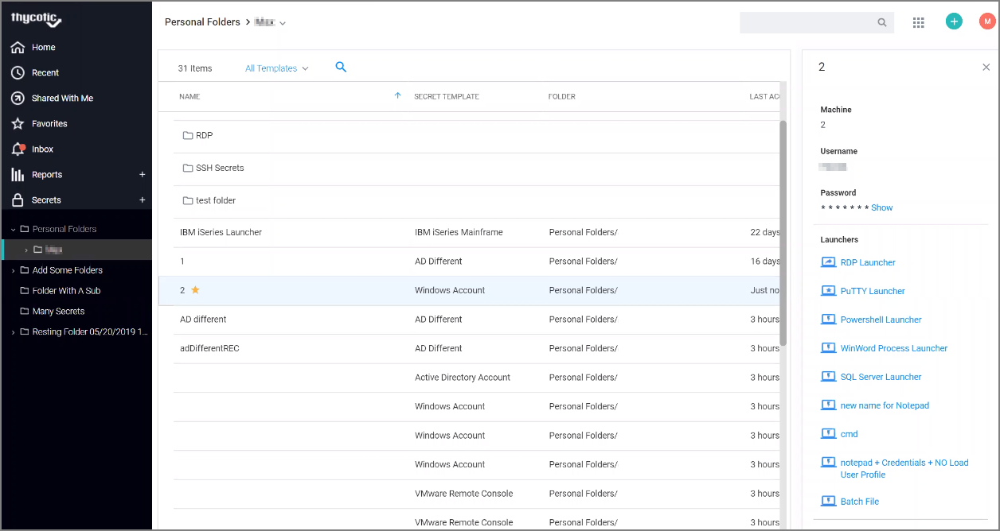
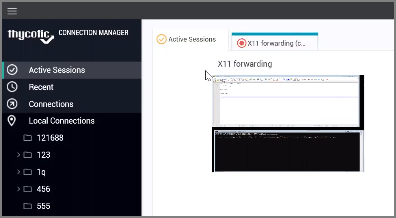
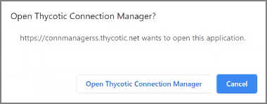
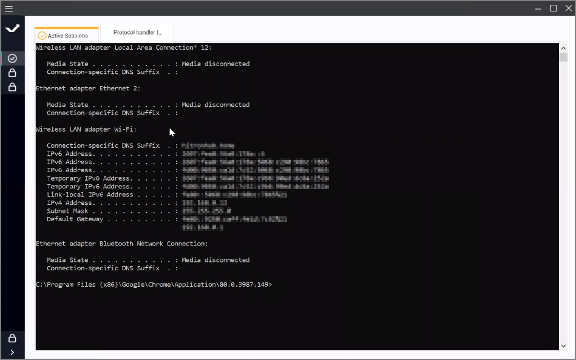
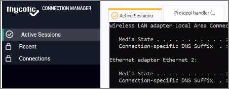
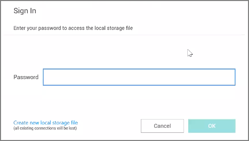
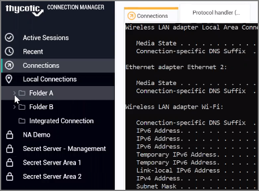
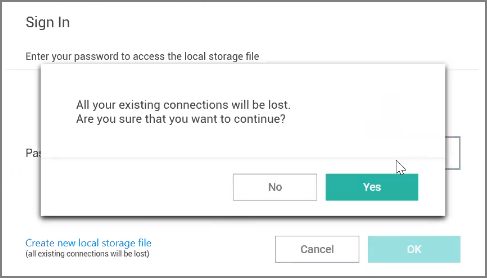

[title]: # (Launchers)
[tags]: # (session recording)
[priority]: # (450)
# Launchers

Connection Manager can act as a protocol handler, which means that Connection Manager can launch Secret Server Secrets that use other Launcher types directly from the Connection Manager UI. Connection Manager supports any launcher that is supported by Secret Server and includes, but is not limited to: PowerShell, CmdLine, MS Word, Notepad, Excel. These launchers also support opening a tab in Connection Manager, session recording, and workflows.

The Secrets with launcher can be launched in the Secret Server UI and have the protocol handler open and run the launcher in Connection Manager. The Secret needs to be configured to use the protocol handler, and when launched it uses Connection Manager if available. When Connection Manager opens, it will be in a "Locked" state, with only the Secret Server launched session(s) being available.

If Connection Manager is launched using the protocol handler and is in the "Locked" state, users have a "Sign In" option available to fully log into Connection Manager to use their other connections.

>**Note**: Local Connections are limited to RDP and SSH launchers.

If session recording is configured to run only on the primary secret, only the primary session will be recorded. If the secret is configured to record multiple windows, Connection Manager honors the setting and all sessions started from the initial session are also recorded.

## Launching from Secret Server without Connection Manager Open

If a protocol handler is launched from Secret Server, without having an open Connection Manager, the __Open Thycotic Connection Manager?__ modal opens:

Click __Open Thycotic Connection Manager__ and an active session is launched in Connection Manager:

In this example the application was opened and placed inside the new tab. Certain applications won't fit in the tab and will be opened in an independent window outside the tab. Other windows opened by the user won't be placed inside the tab either, but everything that originated from the originally launched application will be tracked.

For applications launched from within a Secret Server, the other configured local and existing Secret Server connections remain locked in Connection Manager.

Only navigation between different Active Session tabs initiated from Secret Server is possible.

## Signing In After the Launch

To sign in after an app launch was initiated from Secret Server,

1. From the hamburger menu, select __File | Sign in__ or right-click on Active Session and select __Sign in__.

   
1. Enter your password.
1. Click __OK__.

Once signed in, the user has access to all connections and all Connection Manager functionality is unlocked.

### Create a New Local Storage File

During the sign in, users can select to create a new local storage file by clicking the link in the sign in modal:

>**Note**: If this option is used, existing connections will be lost.
