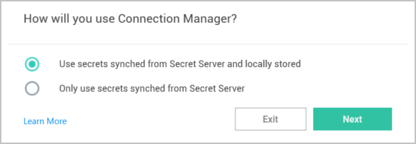

[title]: # (Local Data Vault)
[tags]: # (configure, local, data vault)
[priority]: # (350)

# Local Data Vault

A local data vault is an encrypted and password-protected data file that is stored on the user's local machine.

When you install Connection Manager on a machine for the first time, or when you upgrade to version 1.6.0 or higher, the application asks, "How will you use Connection Manager?"

   

The first choice, **Use secrets synched from Secret Server and locally stored**, enables use of the local data vault.

The second choice, **Only use secrets synched from Secret Server** disables use of the local data vault.

## Enable Local Data Vault

When use of the local data vault is enabled, the user will need to protect this local data by logging into Connection Manager with their password each time they open the application.

With the local data vault enabled, the user can create local RDP and SSH connections to servers and manage them locally. The user can also save Secret Server Connections and credentials locally, so as soon as the user logs into Connection Manager, they are automatically connected to Secret Server. If the network connection is interrupted and then restored, the user is automatically reconnected to Secret Server.

## Disable Local Data Vault

Some administrators might want to prevent users from using the local data vault because using local credentials is inherently less secure than using Secret Server credentials. When use of the local data vault is disabled, the user cannot create local RDP or SSH connections to servers.

The user will not need to log into Connection Manager each time they open the application, but since they cannot save Secret Server connections or credentials locally, they will need to log into Secret Server when they open Connection Manager.
