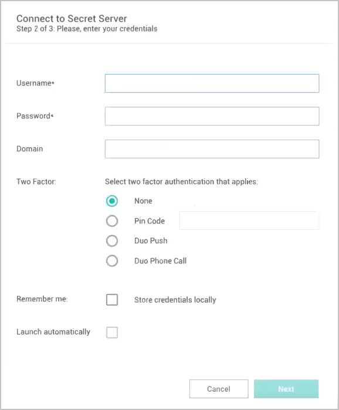

[title]: # (Local Data Vault)
[tags]: # (configure,local,data vault)
[priority]: # (350)

# Local Data Vault

A local data vault is an encrypted and password-protected data file saved on the user's machine that stores local connection credentials and passwords. With the local data vault enabled, the user can create local RDP and SSH connections, and save the connections and credentials locally. The user must protect this local data by logging into Connection Manager with their password each time they open the application. As soon as the user logs into Connection Manager, they are automatically connected to Secret Server.

## Enable Local Data Vault on Installation or Upgrade 
When Connection Manager is installed on a machine for the first time, or when upgrading to version 1.6.0 or higher, the application asks, "How will you use Connection Manager?"

   

The first choice, **Use secrets synched from Secret Server and locally stored**, enables use of the local data vault.

The second choice, **Only use secrets synched from Secret Server** disables use of the local data vault.

## Enable Local Data Vault when Connecting to Secret Server

In the workflow for connecting to Secret Server, the user can choose a "Remember me" option to store their credentials to a local data vault. 

   

## Disable Local Data Vault

For added security, administrators and users can disable storage of connection credentials and passwords in a local data vault. When use of the local data vault is disabled, the user cannot create local RDP or SSH connections. When the local vault is already enabled and the user disables it, any existing local connections will be permanently deleted and the user will only be able to access secrets that are synched from Secret Server. The user will not need to log into Connection Manager each time they open the application, but they will need to log into Secret Server when they open Connection Manager.
