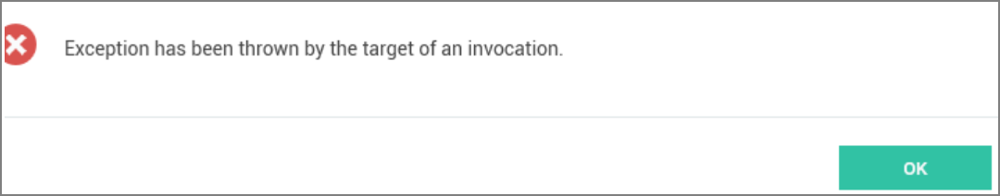

[title]: # (Invocation Error on Connect)
[tags]: # (secret server connection)
[priority]: # (704)
# Invocation Error when Connecting to Secret Server

This topic reviews an error that can be encountered in the Connection Manager 1.2.0 Release, including why the issue might be encountered, what causes it, and a solution to resolve it.

## Issue

In the Connection Manager 1.2.0 release some users might encounter the following error:

`Exception has been thrown by the target of an invocation`
  
As seen below.

This error can be thrown when trying to connect to a Secret Server instance from Connection Manager, and only occurs for Windows installations.

## Reason

In the Connection Manager 1.2.0 release a new Feature was added to allow users to login and connect to Secret Server environments using a __Web login__ method. The purpose of this was to provide a login option that would help support SAML login configurations for Secret Server instances. As a result, this new feature leverages the .NET framework code and bindings for some Chromium Embedded Framework in order to display and use the __Web login__ method.

In most cases the underlying framework for these components is already pre-installed for Windows based workstations, however, some Windows installs may not have these components installed, and this results in the error message above.

>**NOTE**: Most reported cases as of April 18, 2020 seem to occur on new/clean Windows Server installs with minimal configurations.

## Resolution

The `Exception has been thrown by the target of an invocation` error can be resolved for the Connection Manager 1.2.0 release by downloading and installing the following component:

* Visual C++ Redistributable for Visual Studio 2015 - https://aka.ms/vs/16/release/vc_redist.x64.exe

## Future Releases

In the Connection Manager 1.3.0 Release and later this issue should be resolved since the component will be included as part of the Connection Manager installation/update process.
