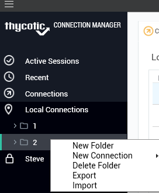
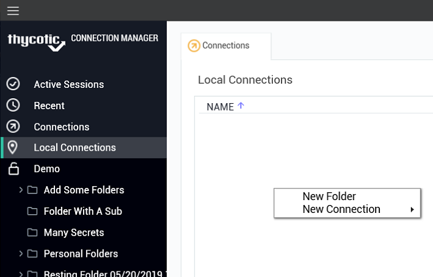

[title]: #	"Menus"
[tags]: #	"menu,ui"
[priority]: #	"305"
# Menus

There are several menu types available in the user interface: an overall menu available from the hamburger control at the top left of the application, and context sensitive right-click menus available throughout the interface.  

## Hamburger Menu

## Right-click Navigation Menu

## Work Area Menu

