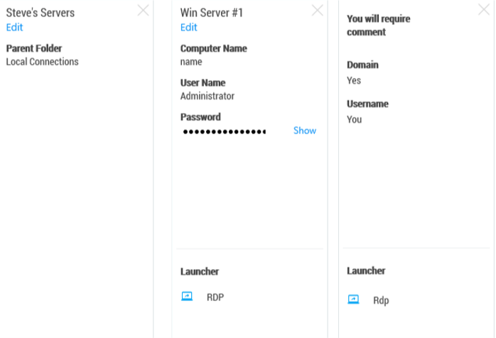

[title]: #	(Work Area)
[tags]: #	(ui,properties)
[priority]: #	(308)
# Work Area

Except for the first tab, the work area consists mostly of tabs representing open connections. The first tab corresponds to one of the selected options in the navigation tree which includes Active Sessions, Recent Connections, or a folder-view of Local Connections/connected Secret Server. For the later, you may navigate through folders directly inside the Connection tab.  

## Work Area Properties

All Local connections, Secret Server connections, and folders have a Properties section. This section allows a user to view some of the details of the connection/folder, and allows users to perform functions on the selected object such as launching a connection, editing properties, viewing passwords, etc.

**Note:** The Properties section for a Secret Server Secret will never display, or have an option to display, the password for that Secret.  